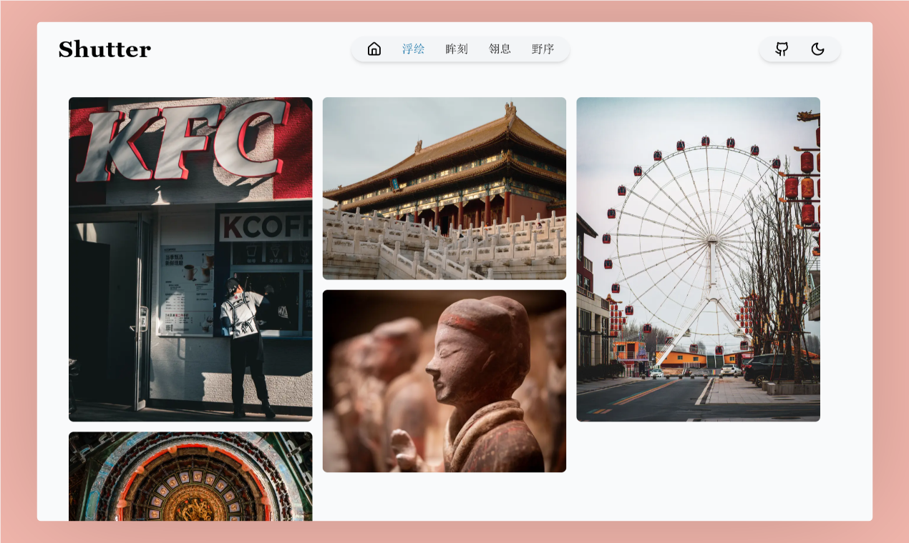
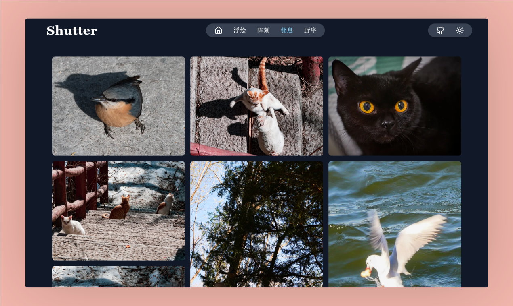

# Shutter-照片展示网站

## 简介

一个基于Nextjs开发的照片展示网站，使用了腾讯云COS存储桶来存储图片。

体验地址：

- [Shutter](https://shutter.luckyabner.top/)

- [备用地址](https://album-next-pi.vercel.app)

## 展示

## 技术栈

- [Nextjs](https://nextjs.org/)
- [Tailwind CSS](https://tailwindcss.com/)
- [Vercel](https://vercel.com)
- [Tencent COS API](https://cloud.tencent.com/document/product/436/7751)

## 使用方式

配置文件填写格式已写在根目录的`example.env`文件中，按要求填写自己的腾讯云COS存储桶的配置即可。

## LICENSE

This project is licensed under the [MIT License](LICENSE).
